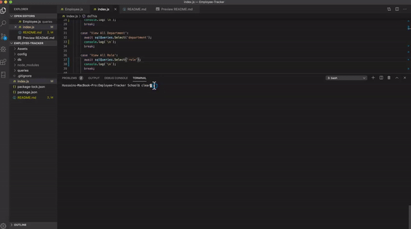

# Employee Tracker
 
  


  ## Description
  A CLI content management system that allows users to view and manipulate employee information stored in a database allowing for better organization and easier planning. 

  Employee-tracker is a CLI content management system that allows the user to manage employees. The app allows the user to add/remove employees, departments and roles. Roles, Managers and employees can be views edited accordingly.
  
  
  ## Installation
  Download the app and run the db/schema.sql file in your preferred mysql GUI to initialize your local database.
  
  
  ## Usage
  Navigate to the project folder in your preferred terminal and run: 
  ```sh 
  npm start
  ```

  

  ## Technologies
  
* mySQL
* Inquirer
